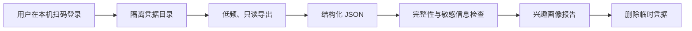

<p align="center">
  
</p>

<p align="center">
  <strong>把你的B站关注、收藏与观看历史，变成一份本地生成、证据分层、可审计的兴趣画像。</strong>
</p>

<p align="center">
  <a href="README_EN.md">English</a> ·
  <a href="#快速开始">快速开始</a> ·
  <a href="PRIVACY.md">隐私</a> ·
  <a href="SECURITY.md">安全</a> ·
  <a href="https://github.com/987161661/bilibil-profile/issues">反馈</a> ·
  <a href="https://github.com/sponsors/987161661">赞助作者</a>
</p>

<p align="center">
  <a href="https://github.com/987161661/bilibil-profile/actions"></a>
  <a href="LICENSE"></a>
  <a href="https://github.com/987161661/bilibil-profile/stargazers"></a>
</p>

> 如果这个项目让你第一次真正看懂自己的兴趣，请点一个 **Star**。它会让更多人发现这个由 [曾梓安（@987161661）](https://github.com/987161661) 创建的项目。

## 它解决什么问题

B站知道你看过什么，但不会替你回答：

- 我真正长期感兴趣的是什么？
- 最近刷屏的热点，是否正在掩盖我的稳定偏好？
- 我忠于少数UP主，还是会围绕问题跨频道探索？
- 为什么B站的推荐让我觉得有“意外发现”，YouTube却越来越单调？
- 如何把这些兴趣迁移为新的频道、学习方向和创作灵感？

本项目将关注、收藏、观看历史、稍后再看与动态样本放在不同证据层级中分析，而不是粗暴地把“点开过”当作“喜欢”。

## 核心特点

- **本地优先**：账号数据默认不离开你的电脑。
- **安全登录**：优先使用隔离目录中的二维码登录，不要求把Cookie贴进聊天。
- **只读设计**：不点赞、不投币、不关注、不发动态、不修改账号。
- **完整性检查**：自动记录分页边界、账面数量、实际导出数量和失效内容。
- **证据分层**：区分长期收藏、跨日观看、单次观看簇与订阅供给。
- **可审计输出**：保留结构化JSON、统计指标、方法限制和Markdown报告。
- **面向AI Agent**：作为 Codex Skill 使用，也可独立运行分析脚本。

## 画像不是算命

它不会根据几个视频给你贴人格标签。核心证据顺序是：

1. 命名收藏夹和反复保存的内容；
2. 跨多日、跨创作者重复出现的主题；
3. 关注结构；
4. 单日或单次观看簇；
5. 动态流——只代表“你订阅的人发布了什么”，不代表你喜欢什么。

## 快速开始

### 方式一：安装为 Codex Skill

```bash
git clone https://github.com/987161661/bilibil-profile.git
mkdir -p ~/.codex/skills
ln -s "$PWD/bilibil-profile/analyze-bilibili-profile" \
  ~/.codex/skills/analyze-bilibili-profile
```

重新启动或刷新 Codex 后输入：

```text
使用 $analyze-bilibili-profile，只读导出并分析我的B站兴趣。
```

Agent 应在本机隔离目录中启动二维码登录、导出数据、生成报告、检查凭据泄漏，并在完成后删除临时凭据。

### 方式二：分析已有导出

```bash
python3 analyze-bilibili-profile/scripts/validate_export.py /path/to/export

python3 analyze-bilibili-profile/scripts/analyze_profile.py \
  --input /path/to/export \
  --output /path/to/bilibili-profile.md
```

规范化数据结构见 [`references/data-sources.md`](analyze-bilibili-profile/references/data-sources.md)。

### 方式三：通过兼容CLI执行只读导出

先安装并审查一个支持JSON输出的B站CLI。本项目开发时使用了独立第三方项目 [`public-clis/bilibili-cli`](https://github.com/public-clis/bilibili-cli)，但不捆绑或背书其代码。

```bash
python3 analyze-bilibili-profile/scripts/export_bilibili.py \
  --bili-command "uv run --project /path/to/bilibili-cli bili" \
  --home /path/to/isolated-home \
  --output /path/to/export
```

登录应使用该CLI的二维码登录命令，并将同一个隔离 `HOME` 传给导出器。完成后删除隔离目录中的凭据文件。

## 典型输出

```text
关注：557/557
观看历史：1200条，覆盖约两周
收藏：328条可见唯一内容
稍后再看：14/14

1200条历史来自821位创作者；
前10位创作者仅占11.8%；
你更像“主题驱动型探索者”，而非少数频道的固定追随者。
```

这是一次真实分析中出现的匿名化统计示例，不包含账户凭据或可识别个人信息。完整示例见 [`examples/EXAMPLE_PROFILE.md`](examples/EXAMPLE_PROFILE.md)。

## 数据流



没有项目服务器位于这条数据流中。

## 安全与法律边界

- 仅分析本人数据、已明确授权的数据或合成测试数据。
- 禁止批量抓取第三方账号、绕过验证码/风控、自动互动或账号监控。
- 本项目不是B站官方产品，使用的是可能变化的非官方网页接口。
- 不要在Issue、PR或聊天中发布 `SESSDATA`、`bili_jct`、Cookie、验证码或原始账户导出。
- 在线托管版本会产生额外的数据保护责任，不能直接继承本地工具的低风险假设。

请阅读：[隐私说明](PRIVACY.md) · [安全政策](SECURITY.md) · [可接受使用](ACCEPTABLE_USE.md) · [法律与平台声明](LEGAL.md)。

## 项目结构

```text
analyze-bilibili-profile/
├── SKILL.md
├── agents/openai.yaml
├── references/data-sources.md
├── scripts/
│   ├── export_bilibili.py
│   ├── analyze_profile.py
│   └── validate_export.py
└── tests/
```

## 贡献

欢迎改进分类体系、统计指标、兼容性和隐私保护。所有测试必须使用合成数据，禁止提交真实账号导出。

开始前请阅读 [CONTRIBUTING.md](CONTRIBUTING.md) 和 [CODE_OF_CONDUCT.md](CODE_OF_CONDUCT.md)。

## 支持作者

这个项目由 [曾梓安（@987161661）](https://github.com/987161661) 发起和维护。

你可以通过以下方式支持：

1. 给仓库一个 Star；
2. 在B站、朋友圈、技术社区分享你的脱敏画像发现；
3. 提交Issue、测试和Pull Request；
4. 点击仓库右侧的 **Sponsor** 按钮赞助维护。

赞助将用于兼容接口变化、完善分类模型、制作一键安装体验和隐私审计。

## 许可证与署名

代码使用 [MIT License](LICENSE)。如果项目帮助了你的研究、产品或内容，请保留项目链接并使用 [`CITATION.cff`](CITATION.cff) 引用作者。

---

<p align="center">
  Built with curiosity and unreasonable care by <a href="https://github.com/987161661">曾梓安 · @987161661</a>.
</p>
